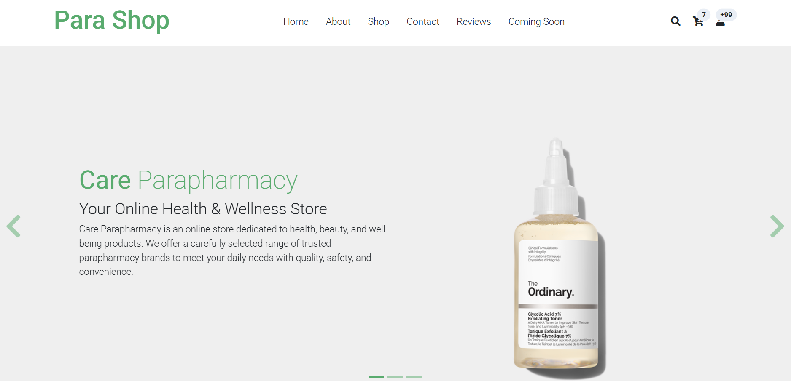
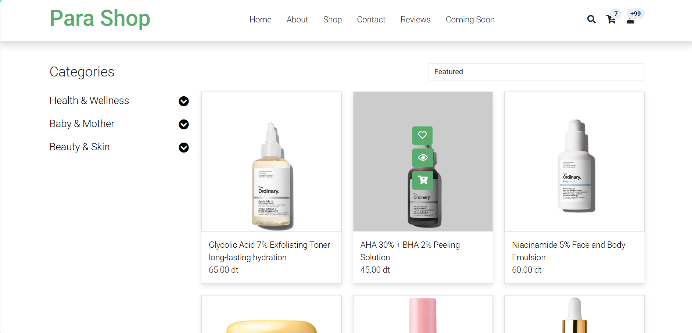
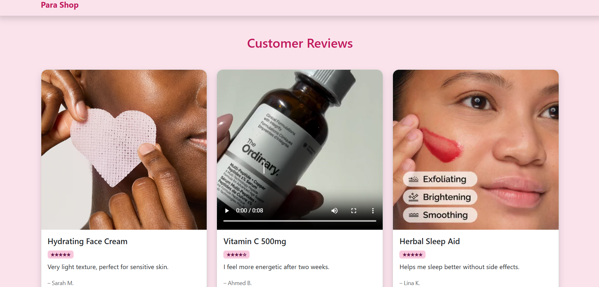
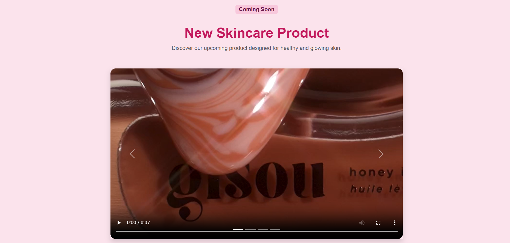
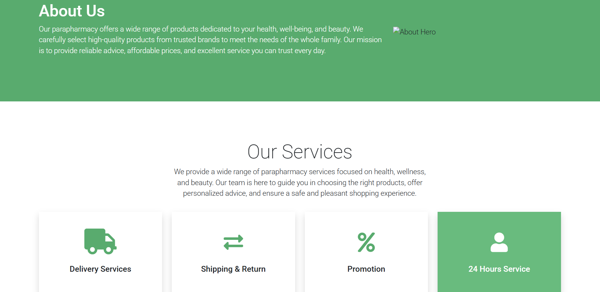
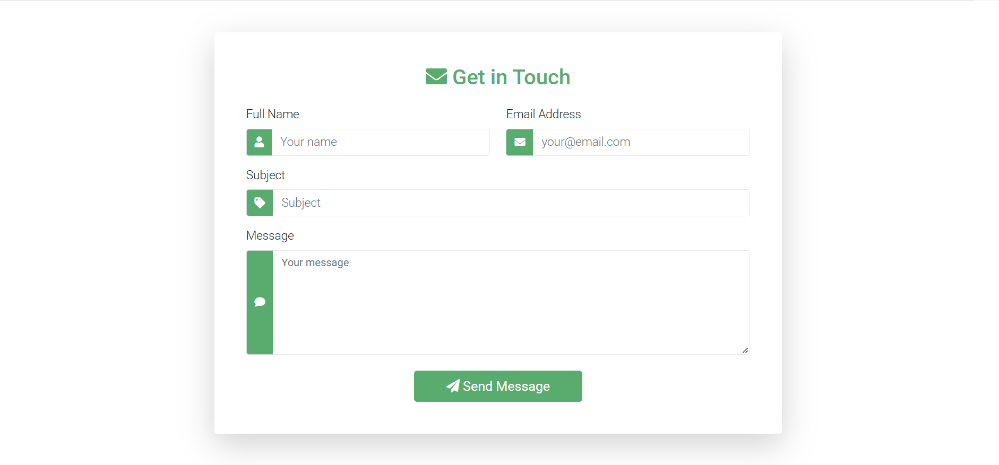

<div align="center">

# 🌿 Para Shop

### Votre parapharmacie en ligne — soins, beauté & bien-être

Front-end e-commerce responsive pour une parapharmacie, construit avec **HTML5**, **CSS3**, **Bootstrap 5** et **JavaScript**.

<br>


<br>



</div>

---

## 📑 Table des matières

- [À propos](#-à-propos)
- [Fonctionnalités](#-fonctionnalités)
- [Aperçu](#-aperçu)
- [Stack technique](#-stack-technique)
- [Structure du projet](#-structure-du-projet)
- [Installation](#-installation)
- [Pages du site](#-pages-du-site)
- [Roadmap](#-roadmap)
- [Contribuer](#-contribuer)
- [Crédits](#-crédits)
- [Auteur](#-auteur)

---

## 💡 À propos

**Para Shop** est une vitrine e-commerce dédiée à la parapharmacie : soins du visage, soins des cheveux, soins des lèvres, compléments et produits de bien-être.

Le projet met l'accent sur une **expérience utilisateur claire** (navigation par catégories, fiches produits détaillées, avis clients) et sur une **identité visuelle soignée**, alliant le vert « santé » et le rose « beauté ».

> 🎯 **Objectif :** proposer une base front-end propre, maintenable et prête à être connectée à un back-end (PHP / MySQL, API REST, etc.).

---

## ✨ Fonctionnalités

| | Fonctionnalité | Description |
|---|---|---|
| 🏠 | **Accueil** | Bannière, produits mis en avant et catégories |
| 🛍️ | **Catalogue produits** | Liste des produits avec filtrage par catégories (Santé & Bien-être, Bébé & Maman, Beauté & Peau…) |
| 🔎 | **Fiche produit** | Galerie d'images, description et informations détaillées |
| 🛒 | **Panier** | Récapitulatif des articles sélectionnés |
| 💳 | **Checkout** | Page de finalisation de commande |
| 🔐 | **Connexion** | Formulaire d'authentification |
| ⭐ | **Avis clients** | Témoignages et retours sur les produits |
| 🚀 | **Nouveautés à venir** | Carrousel « Coming Soon » avec vidéos (pause automatique au changement de slide) |
| 📬 | **Contact** | Formulaire de contact |
| ℹ️ | **À propos** | Présentation et services : livraison, retours, promotions, service 24h/24 |
| 📱 | **Responsive** | Interface adaptée mobile, tablette et desktop |

---

## 📸 Aperçu

### 🏠 Accueil

<div align="center">
  
</div>

<br>

### 🛍️ Catalogue & fiche produit

<table>
  <tr>
    <td align="center" width="50%">
      <br>
      <sub><b>Catalogue produits</b></sub>
    </td>
    <td align="center" width="50%">
      <br>
      <sub><b>Fiche produit</b></sub>
    </td>
  </tr>
</table>

### ⭐ Avis clients & nouveautés

<table>
  <tr>
    <td align="center" width="33%">
      <br>
      <sub><b>Avis clients</b></sub>
    </td>
    <td align="center" width="33%">
      <br>
      <sub><b>Nouveau produit</b></sub>
    </td>
    <td align="center" width="33%">
      <br>
      <sub><b>Coming soon</b></sub>
    </td>
  </tr>
</table>

### 📬 À propos & contact

<table>
  <tr>
    <td align="center" width="50%">
      <br>
      <sub><b>À propos</b></sub>
    </td>
    <td align="center" width="50%">
      <br>
      <sub><b>Contact</b></sub>
    </td>
  </tr>
</table>

---

## 🛠️ Stack technique

| Catégorie | Technologies |
|---|---|
| **Structure** | HTML5 |
| **Style** | CSS3, Bootstrap 5, thème basé sur *Zay Shop* (TemplateMo) |
| **Interactivité** | JavaScript (ES6), jQuery, Slick Carousel |
| **Icônes & polices** | Font Awesome, Google Fonts (Roboto) |
| **Environnement local** | XAMPP / tout serveur HTTP statique |
| **Versioning** | Git & GitHub |

---

## 📂 Structure du projet

```
Para-Shop/
├── index.html          # Page d'accueil
├── shop.html           # Catalogue produits
├── shop-single.html    # Fiche produit
├── cart.html           # Panier
├── checkout.html       # Finalisation de commande
├── login.html          # Connexion
├── review.html         # Avis clients
├── coming.html         # Nouveautés à venir
├── about.html          # À propos
├── contact.html        # Contact
└── assets/
    ├── css/            # Bootstrap, templatemo, Font Awesome, Slick, custom.css
    ├── js/             # jQuery, Bootstrap bundle, Slick, custom.js
    ├── img/            # Images produits et vidéos
    ├── webfonts/       # Polices Font Awesome & Slick
    └── screenshots/    # Captures d'écran du README
```

---

## 🚀 Installation

### Prérequis

- Un navigateur moderne (Chrome, Firefox, Edge, Safari)
- *(Optionnel)* [XAMPP](https://www.apachefriends.org/) ou tout autre serveur local

### 1. Cloner le dépôt

```bash
git clone https://github.com/AjmiOns/Parapharmacy-Website.git
cd Parapharmacy-Website
```

### 2. Lancer le projet

**Option A — Directement dans le navigateur**

Ouvrez simplement `index.html`.

**Option B — Avec XAMPP**

1. Copiez le dossier dans `C:\xampp\htdocs\`
2. Démarrez **Apache** depuis le panneau XAMPP
3. Rendez-vous sur 👉 `http://localhost/Para-Shop/`

**Option C — Avec un serveur statique rapide**

```bash
# Python
python -m http.server 8000

# ou Node.js
npx serve .
```

Puis ouvrez `http://localhost:8000`.

---

## 🗺️ Pages du site

| Page | Fichier | Rôle |
|---|---|---|
| Accueil | `index.html` | Point d'entrée, produits phares |
| Boutique | `shop.html` | Liste des produits et catégories |
| Détail produit | `shop-single.html` | Informations complètes d'un produit |
| Panier | `cart.html` | Articles sélectionnés |
| Paiement | `checkout.html` | Finalisation de la commande |
| Connexion | `login.html` | Accès au compte |
| Avis | `review.html` | Retours clients |
| Nouveautés | `coming.html` | Produits à venir |
| À propos | `about.html` | Présentation et services |
| Contact | `contact.html` | Formulaire de contact |

---

## 🧭 Roadmap

- [x] Maquettes et intégration des pages principales
- [x] Design responsive avec Bootstrap 5
- [x] Carrousel de nouveautés avec vidéos
- [ ] Panier dynamique (ajout / suppression / calcul du total en JavaScript)
- [ ] Recherche et filtres fonctionnels sur le catalogue
- [ ] Page d'inscription (`register.html`)
- [ ] Back-end (PHP / MySQL ou API REST) : comptes, produits, commandes
- [ ] Paiement en ligne sécurisé
- [ ] Optimisation des performances (compression des images et vidéos)
- [ ] Accessibilité (WCAG) et SEO
- [ ] Support multilingue (FR / EN / AR)

---

## 🤝 Contribuer

Les contributions sont les bienvenues !

1. **Forkez** le projet
2. Créez une branche : `git checkout -b feature/ma-fonctionnalite`
3. Commitez : `git commit -m "feat: ajout de ma fonctionnalité"`
4. Poussez : `git push origin feature/ma-fonctionnalite`
5. Ouvrez une **Pull Request**

**Convention de commits** : [Conventional Commits](https://www.conventionalcommits.org/fr/) (`feat:`, `fix:`, `docs:`, `style:`, `refactor:`…).

---

## 🙏 Crédits

- Thème de base : [Zay Shop – TemplateMo 559](https://templatemo.com/tm-559-zay-shop)
- Icônes : [Font Awesome](https://fontawesome.com/)
- Composants UI : [Bootstrap](https://getbootstrap.com/)
- Carrousel : [Slick](https://kenwheeler.github.io/slick/)
- Les visuels produits appartiennent à leurs marques respectives et sont utilisés à des fins de démonstration uniquement.

---

## 👩‍💻 Auteur

**Ons Ajmi** — [@AjmiOns](https://github.com/AjmiOns)

<div align="center">

⭐ Si ce projet vous plaît, n'hésitez pas à lui laisser une étoile !

<sub>Fait avec 💚 et beaucoup de ☕</sub>

</div>
