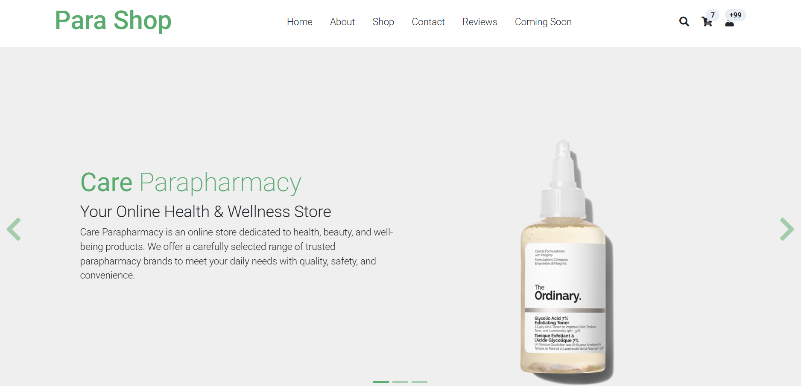
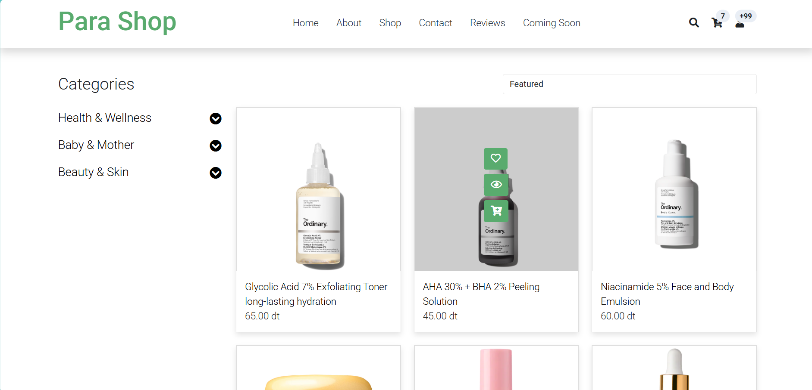
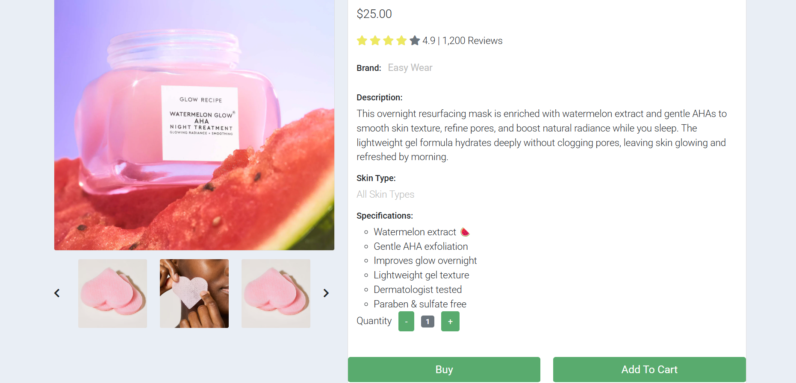
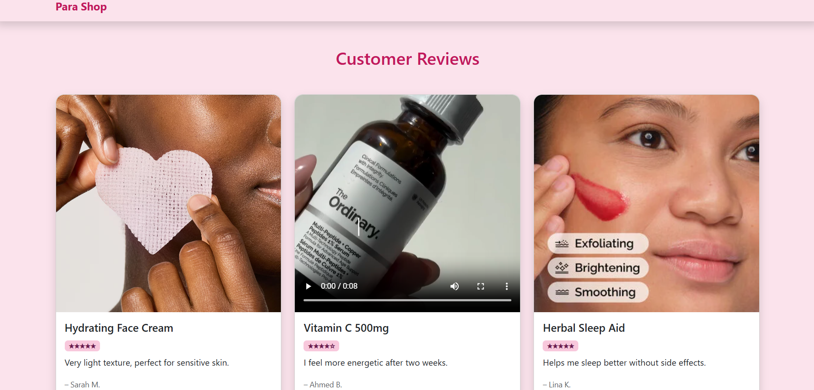
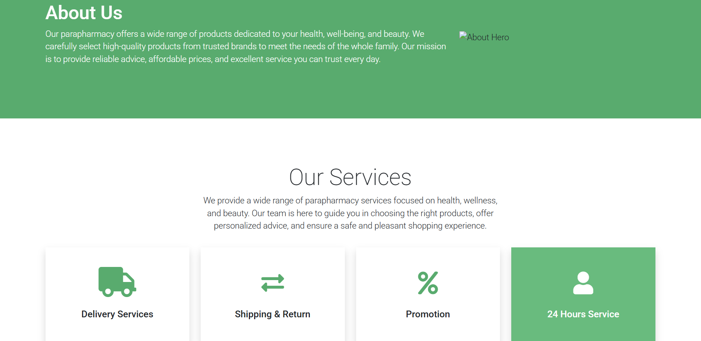
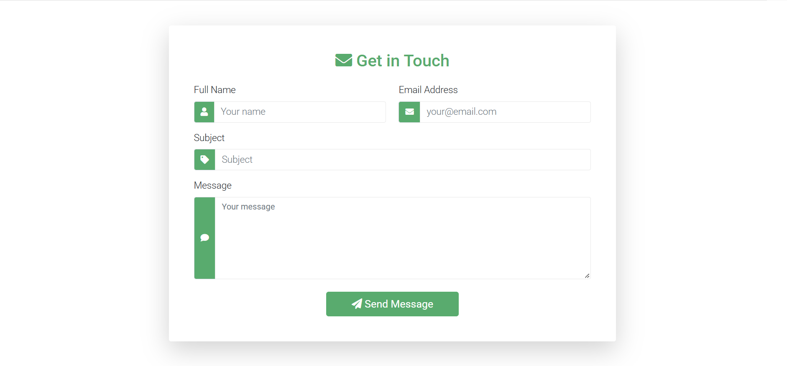

<div align="center">

# 🌿 Para Shop

### Your online parapharmacy — care, beauty & wellness

Responsive e-commerce front-end for a parapharmacy, built with **HTML5**, **CSS3**, **Bootstrap 5** and **JavaScript**.

<br>


<br>



</div>

---

## 📑 Table of Contents

- [About](#-about)
- [Features](#-features)
- [Preview](#-preview)
- [Tech Stack](#️-tech-stack)
- [Project Structure](#-project-structure)
- [Installation](#-installation)
- [Site Pages](#️-site-pages)
- [Roadmap](#-roadmap)
- [Contributing](#-contributing)
- [Credits](#-credits)
- [Author](#-author)

---

## 💡 About

**Para Shop** is an e-commerce showcase dedicated to parapharmacy: face care, hair care, lip care, supplements and wellness products.

The project focuses on a **clear user experience** (category navigation, detailed product pages, customer reviews) and a **polished visual identity**, combining "health" green with "beauty" pink.

> 🎯 **Goal:** to provide a clean, maintainable front-end foundation, ready to be connected to a back-end (PHP / MySQL, REST API, etc.).

---

## ✨ Features

| | Feature | Description |
|---|---|---|
| 🏠 | **Home** | Banner, featured products and categories |
| 🛍️ | **Product catalog** | Product list with category filtering (Health & Wellness, Baby & Mom, Beauty & Skin…) |
| 🔎 | **Product page** | Image gallery, description and detailed information |
| 🛒 | **Cart** | Summary of the selected items |
| 💳 | **Checkout** | Order completion page |
| 🔐 | **Login** | Authentication form |
| ⭐ | **Customer reviews** | Testimonials and feedback on products |
| 🚀 | **Upcoming products** | "Coming Soon" carousel with videos (automatic pause when the slide changes) |
| 📬 | **Contact** | Contact form |
| ℹ️ | **About** | Presentation and services: delivery, returns, promotions, 24/7 service |
| 📱 | **Responsive** | Interface adapted for mobile, tablet and desktop |

---

## 📸 Preview

### 🏠 Home

<div align="center">
  
</div>

<br>

### 🛍️ Catalog & product page

<table>
  <tr>
    <td align="center" width="50%">
      <br>
      <sub><b>Product catalog</b></sub>
    </td>
    <td align="center" width="50%">
      <br>
      <sub><b>Product page</b></sub>
    </td>
  </tr>
</table>

### ⭐ Customer reviews & upcoming products

<table>
  <tr>
    <td align="center" width="33%">
      <br>
      <sub><b>Customer reviews</b></sub>
    </td>
    <td align="center" width="33%">
      <br>
      <sub><b>New product</b></sub>
    </td>
    <td align="center" width="33%">
      <br>
      <sub><b>Coming soon</b></sub>
    </td>
  </tr>
</table>

### 📬 About & contact

<table>
  <tr>
    <td align="center" width="50%">
      <br>
      <sub><b>About</b></sub>
    </td>
    <td align="center" width="50%">
      <br>
      <sub><b>Contact</b></sub>
    </td>
  </tr>
</table>

---

## 🛠️ Tech Stack

| Category | Technologies |
|---|---|
| **Structure** | HTML5 |
| **Styling** | CSS3, Bootstrap 5, theme based on *Zay Shop* (TemplateMo) |
| **Interactivity** | JavaScript (ES6), jQuery, Slick Carousel |
| **Icons & fonts** | Font Awesome, Google Fonts (Roboto) |
| **Local environment** | XAMPP / any static HTTP server |
| **Versioning** | Git & GitHub |

---

## 📂 Project Structure

```
Para-Shop/
├── index.html          # Home page
├── shop.html           # Product catalog
├── shop-single.html    # Product page
├── cart.html           # Cart
├── checkout.html       # Order completion
├── login.html          # Login
├── review.html         # Customer reviews
├── coming.html         # Upcoming products
├── about.html          # About
├── contact.html        # Contact
└── assets/
    ├── css/            # Bootstrap, templatemo, Font Awesome, Slick, custom.css
    ├── js/             # jQuery, Bootstrap bundle, Slick, custom.js
    ├── img/            # Product images and videos
    ├── webfonts/       # Font Awesome & Slick fonts
    └── screenshots/    # README screenshots
```

---

## 🚀 Installation

### Prerequisites

- A modern browser (Chrome, Firefox, Edge, Safari)
- *(Optional)* [XAMPP](https://www.apachefriends.org/) or any other local server

### 1. Clone the repository

```bash
git clone https://github.com/AjmiOns/Parapharmacy-Website.git
cd Parapharmacy-Website
```

### 2. Run the project

**Option A — Directly in the browser**

Simply open `index.html`.

**Option B — With XAMPP**

1. Copy the folder to `C:\xampp\htdocs\`
2. Start **Apache** from the XAMPP control panel
3. Go to 👉 `http://localhost/Para-Shop/`

**Option C — With a quick static server**

```bash
# Python
python -m http.server 8000

# or Node.js
npx serve .
```

Then open `http://localhost:8000`.

---

## 🗺️ Site Pages

| Page | File | Purpose |
|---|---|---|
| Home | `index.html` | Entry point, featured products |
| Shop | `shop.html` | Product list and categories |
| Product details | `shop-single.html` | Complete information about a product |
| Cart | `cart.html` | Selected items |
| Checkout | `checkout.html` | Order completion |
| Login | `login.html` | Account access |
| Reviews | `review.html` | Customer feedback |
| New arrivals | `coming.html` | Upcoming products |
| About | `about.html` | Presentation and services |
| Contact | `contact.html` | Contact form |

---

## 🧭 Roadmap

- [x] Mockups and integration of the main pages
- [x] Responsive design with Bootstrap 5
- [x] New arrivals carousel with videos
- [ ] Dynamic cart (add / remove / total calculation in JavaScript)
- [ ] Working search and filters on the catalog
- [ ] Registration page (`register.html`)
- [ ] Back-end (PHP / MySQL or REST API): accounts, products, orders
- [ ] Secure online payment
- [ ] Performance optimization (image and video compression)
- [ ] Accessibility (WCAG) and SEO
- [ ] Multilingual support (FR / EN / AR)

---

## 🤝 Contributing

Contributions are welcome!

1. **Fork** the project
2. Create a branch: `git checkout -b feature/my-feature`
3. Commit: `git commit -m "feat: add my feature"`
4. Push: `git push origin feature/my-feature`
5. Open a **Pull Request**

**Commit convention:** [Conventional Commits](https://www.conventionalcommits.org/) (`feat:`, `fix:`, `docs:`, `style:`, `refactor:`…).

---

## 🙏 Credits

- Base theme: [Zay Shop – TemplateMo 559](https://templatemo.com/tm-559-zay-shop)
- Icons: [Font Awesome](https://fontawesome.com/)
- UI components: [Bootstrap](https://getbootstrap.com/)
- Carousel: [Slick](https://kenwheeler.github.io/slick/)
- Product visuals belong to their respective brands and are used for demonstration purposes only.

---

## 👩‍💻 Author

<p align="center">
  <strong>Ons Ajmi</strong> — Engineering Student in Cloud Infrastructure Management @ TEK-UP University<br>
  GitHub : <a href="https://github.com/AjmiOns">AjmiOns</a> · 
  LinkedIn : <a href="https://www.linkedin.com/in/ons-ajmi-0ab2982a2/">Ons Ajmi</a>
</p>

<div align="center">

⭐ If you like this project, feel free to give it a star!

<sub>Made with 💚 and lots of ☕</sub>

</div>


